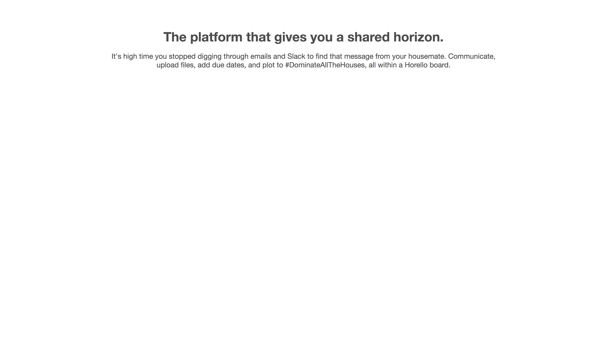
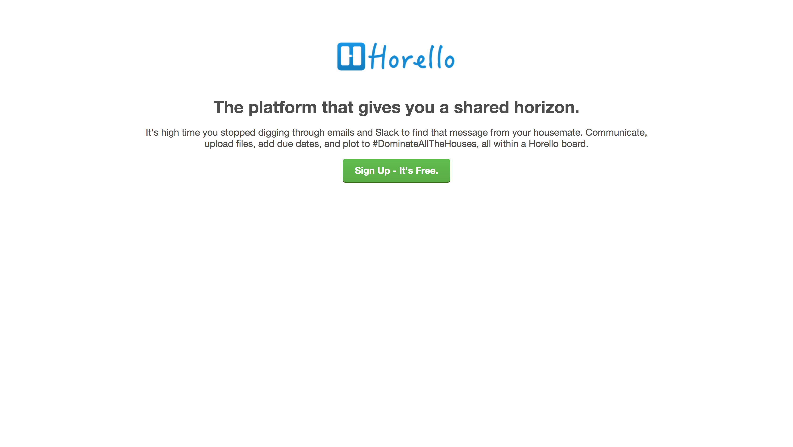
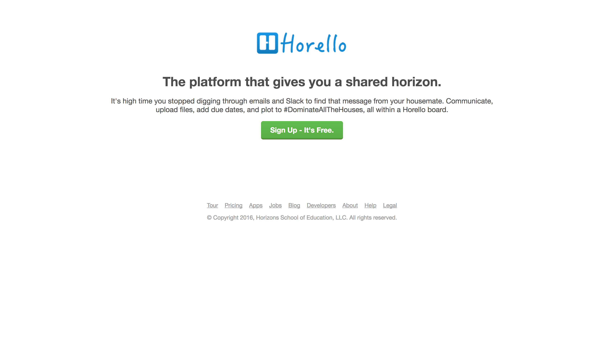
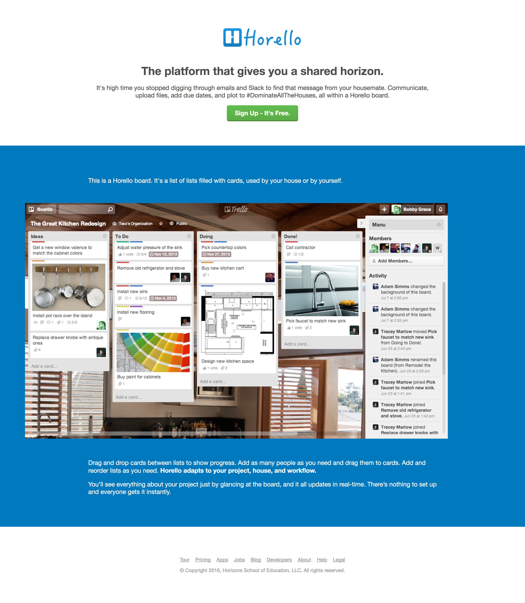
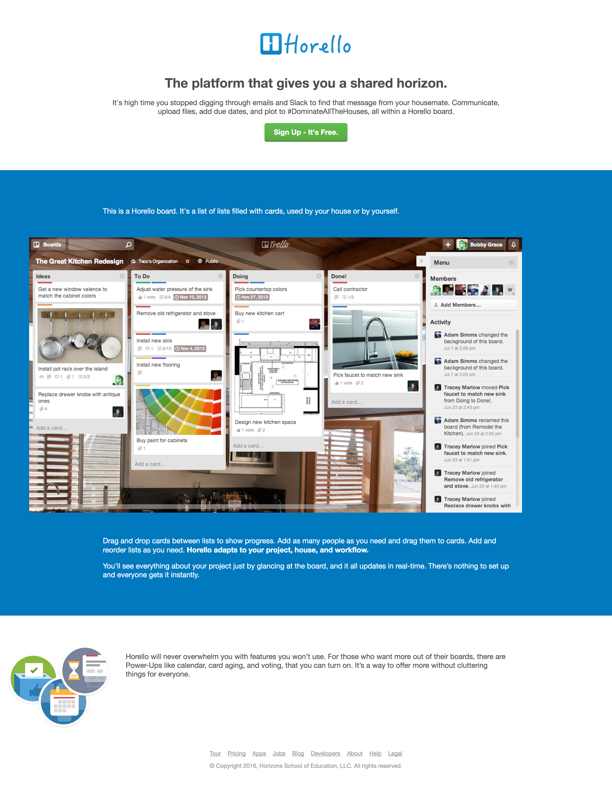

# HTML and CSS Intro: Building a landing page

## Git Repository Setup

1. Open your Terminal

    1. **(Mac)** Open the Terminal app located in `/Applications/Utilities/Terminal.app`
    1. **(Windows)** Open Git Bash from the Start Menu.

1. Create a new directory for  iCode material and `cd` into it.

    ```bash
    mkdir iCode
    cd iCode
    ```

1. Run `pwd` to confirm you're in the right directory.

    ```bash
    pwd
    ```

    You should see that you're now in a directory named `iCode`:

    ```
    $ pwd
    YOUR HOME DIRECTORY HERE/iCode
    ```

1. Clone the `Horello` repository

    ```bash
    git clone git@github.com:iCode-Network/Horello.git
    ```

1. Go into the the `Horello` directory

    ```bash
    cd Horello
    ```

1. Create your own branch with your GitHub username

    ```bash
    git checkout -b YOUR GITHUB USERNAME HERE
    ```


1. Set-up your Git environment

    ```bash
    ./setup.sh
    ```

1. Push your branch to GitHub

    ```bash
    git push -u origin
    ```

Congratulations, you're ready to work on Horello exercise!

Congratulations on being hired and welcome to the Horello, Inc. team! As
our latest web development hire, we're relying on you to build the
landing page for our flagship product, Horello, a shared task manager.
The rest of our web team is currently on a retreat in Tahiti, but we've
left these instructions so you should have everything you need to get
started building your first web page using HTML and CSS. Your task is to
create a pixel perfect clone of the following image.


As a web developer, you'll be working closely with our designers
who will give you a set of asset files (images), specifications, and
mockups (a.k.a. "mocks", "wireframes") to show you the expected final
product.

For this project, we've provided you with a basic HTML outline, some
empty CSS files, and [specifications][specs]. You'll begin by applying
some of the CSS styles you learned in class this morning. Later you'll
add more HTML and try some more sophisticated HTML and CSS techniques to
add images and interactive elements to the page.

## A few important details

- You'll be working in the `skeleton` directory. Each part of the
project is contained in HTML and CSS files prefixed with the part
number, e.g., `1_top.html`.
- Study the mockup screenshots closely. Use an app like Preview in OS X
so that you can easily pan, zoom, and measure things.
- Get very comfortable using Chrome's Developer Tools (⌥⌘I, or View >
Developer > Developer Tools).
- The best way to do web development is to make small, incremental
changes to the HTML and CSS and then reload in the browser to see the
changes. When you get comfortable using the power Developer Tools,
you'll see how to test individual changes in real time without
changing your code.
- Keep the [specs] handy as you'll need them throughout this project.

## Part 1: Title

This is what we will be building in Part 1:


We will now walk through the steps required to reproduce the above
page.

Let's begin by applying some basic styles to text.

1. **open [`Horello/skeleton/01-title.html`](./skeleton/01-title.html) in your browser**:
you should see an unstyled heading followed by a block of text. After
each step below be sure to refresh this page to make sure the appropriate
changes show up.

1. **open the following files in your text editor**:
    1. [`Horello/skeleton/01-title.html`](./skeleton/01-title.html): contains
	some fundamental HTML tags such as `html`, `head`, `body`, and `meta` &
	includes two stylesheets (you will need to include the remaining stylesheets)
	1. [`Horello/skeleton/css/01-title.css`](./skeleton/css/01-title.css):
	this is where you should write your CSS classes
	1. [`Horello/SPECIFICATIONS.md`](./SPECIFICATIONS.md): an overview
	of what styles you need to use

	**Note** that `section` tag in your `01-title.html` file is
	an HTML5 [semantic tag], and that you could have used the
	non-semantic `div` tag here instead.

1. **add styles to the body**: Use the default properties specified
in the [specs]. Because of the way CSS properties _cascade_ down
to child elements, these styles will apply, by default,
to all of the text in our page.
	- `font-family`
	- `font-size` (medium)
	- `font-weight`
	- `color` (use default font color)

1. **add styles to the `h2` selector**:
    - `font-size` (large)

1. **center the text**:
    - add the `text-align: center` property to the `text-center` CSS class
	- apply the `text-center` class to the `<section>` in `01-title.html`

1. **fix the spacing for `<section>`**:
    - padding (Section padding)

1. **add margins**: add these styles to the `center-paragraph` class
    - margin (looks at [specs] for vertical and horizontal margin sizes)
	- add this class to the `<p>` tag in `01-title.html`

Note that spacing can be specified in a variety of ways in CSS. You can
specify a number followed by "px", which refers to an absolute number of
pixels. You can also use "em" instead of "px", where "1em" is equal to
the font size (in pixels) applied to the element. See [the full
list of CSS units][cssdocs] if you're curious.

Reload again to see your changes. Congrats on finishing Part 1!

Supplemental reading (optional):
- [CSS Units][cssunits]
- [HTML5 semantic tags][semantic tag]
- [CSS Reset][reset-1]
- [normalize.css][reset-2]

[reset-1]: http://meyerweb.com/eric/tools/css/reset/
[reset-2]: https://necolas.github.io/normalize.css/
[cssunits]: http://www.w3schools.com/cssref/css_units.asp
[semantic tag]: http://www.w3schools.com/html/html5_semantic_elements.asp

## Part 2: Image and button

This is what we will be building in Part 2:


CSS is a very powerful tool, and it can do a lot more than just spacing
and typography. In fact, it can be used to create some very complex,
dynamic elements such as [2d shapes], [3d transforms], and some very
nifty [effects]. CSS has even been used to create an FPS-style [3d
game]. In this part, you'll begin to see some of the power of CSS to
create interactive elements.

Let's finish the first section of the landing page by adding an image
and a button. Open the part 2 files (you can close the part 1 files:
all of your CSS work will be applied in all future parts!) in your
text editor and web browser.

1. **open [`Horello/skeleton/02-button.html`](./skeleton/02-button.html)
in your browser**. After each step below be sure to refresh this page to
make sure the appropriate changes show up.

1. **open the following files in your text editor**:
    1. [`Horello/skeleton/02-button.html`](./skeleton/02-button.html): contains
	some fundamental HTML tags such as `html`, `head`, `body`, and `meta` &
	includes an image followed by a header, some text, and a button.
	1. [`Horello/skeleton/css/02-button.css`](./skeleton/css/02-button.css):
	this is where you should write your CSS classes
	1. [`Horello/SPECIFICATIONS.md`](./SPECIFICATIONS.md): an overview
	of what styles you need to use

1. **add margins to the ``**:
    - add a bottom margin property to the `img-title` class per the [specs].
	*note* that we use a class-selector here because, while we want to
	add a margin to this particular image, we don't	necessarily want that
	style to apply to all images throughout the page (as you'll see later).

1. **inspect the button**: look at the button in the screenshot for part 2, and
note the following:
    - it isn't a solid color, but rather, there's a color
    gradient applied from top to bottom (the color gets slightly darker
    towards the bottom)
    - it has rounded corners, no border, and a slight drop shadow
    to give it some depth
    - it has bold white text with padding on all four sides
	- the button color should change when you hover your mouse
	over it (look at specifications)

1. **style the button**: get the values from the [specs]
    - `padding` (vertical/horizontal)
	- `border`
	- `border-radius` (for rounded corners)
	- `color`
	- `font-weight`
	- `display`: making this `inline-block` ensures that it conforms to the
	padding of the previous element (they are `inline` by default)
	- `background`: this will be a color gradient. use the following command
	(replace the `START` and `END` placeholders with the relevent color
	hex codes from the [specs]):
      ```css
      background: linear-gradient(to bottom, #START 0, #END 100%);
      ```
	- `box-shadow`: add the drop shadow to the selector using this format (replacing `COLOR`
	with the hex code from the [specs]):
      ```css
      box-shadow: 0 2px 0 #COLOR;
      ```

1. **style the button on hover**: add the "hover" color gradient to the
"hover" pseudo class for the `.button` class.
    - background: add the gradient for button hover
	- color: same as without the pseudo selector `:hover`

Supplemental reading (optional):
- [Shapes of CSS][2d shapes]
- [Intro to CSS 3D transforms][3d transforms]
- [Example CSS effect][effects]
- [CSS FPS][3d game]

[2d shapes]: https://css-tricks.com/examples/ShapesOfCSS/
[3d transforms]: https://desandro.github.io/3dtransforms/
[effects]: http://codepen.io/supah/full/dGLLPK/
[3d game]: http://keithclark.co.uk/labs/css-fps/

## Part 3: Footer

This is what we will be building in Part 3:


As a next step, let's add a straightforward footer to our landing page
with some catch-all links such as Pricing, Jobs, and Blog, and a
copyright notice. See the screenshot for the complete list, and notice the
formatting: the footer links are evenly spaced, they're underlined,
they have a different color and font size from the rest of the document,
and the color is different when you move your mouse over them (hover).

1. **open [`Horello/skeleton/03-footer.html`](./skeleton/03-footer.html)
in your browser**. After each step below be sure to refresh this page to
make sure the appropriate changes show up.

1. **open the following files in your text editor**:
    1. [`Horello/skeleton/03-footer.html`](./skeleton/03-footer.html): contains
	some fundamental HTML tags such as `html`, `head`, `body`, and `meta` &
	includes pre-populated code for the footer
	1. [`Horello/skeleton/css/03-footer.css`](./skeleton/css/03-footer.css):
	this is where you should write your CSS classes. **NOTE** that this css file
	contains a bunch of empty "footer" selectors, such as "footer a". This compound
	selector matches all `a` tags _inside a `footer` tag_, so these styles
	will only apply to the contents of the `footer`.
	1. [`Horello/SPECIFICATIONS.md`](./SPECIFICATIONS.md): an overview
	of what styles you need to use

1. **fix the spacing for the `footer` selector**:
    - apply the same `padding` property as `<section>` to `<footer>`: note
	that You can apply a set of properties to multiple selectors by
	specifying the list selectors separated by commas(`section, footer: { padding:
	80px 20px' }`).

1. **fix the font size and color for `<footer>`**: add following styles to the
`footer` class in your `03-footer.css` file.
    - `font-size`: use the smallest font-size
	- `color`: use the appropriate color

1. **add styles to `<a>` tags within `<footer>`**: add following styles to
`footer a` and `footer a:hover` classes.
    - `color` (for `footer a`)
	- `color` (for `footer a:hover`)

1. **reset `<ul>` padding**: by default `ul` list elements get left padding
so for `footer ul` set padding to 0
    - `padding`

1. **styles for `<li>`**: we want to display the list elements side-by-side
and spaced out. add styles to `footer li`.
    - `display` (make it inline-block)
	- `margin` (look at footer link spacing in [specs])


## Part 4: Content

This is what we will be building in Part 4:


With those basics in place, let's add another section in between the
title and the footer with some text and an image. With the scaffolding
we already have in place, this is going to be easier than you think.

1. **open [`Horello/skeleton/04-content.html`](./skeleton/04-content.html)
in your browser**. After each step below be sure to refresh this page to
make sure the appropriate changes show up.

1. **open the following files in your text editor**:
    1. [`Horello/skeleton/04-content.html`](./skeleton/04-content.html): contains
	some fundamental HTML tags such as `html`, `head`, `body`, and `meta` &
	we've added another `section` tag in the middle, with some paragraph
	text and an image.
	1. [`Horello/skeleton/css/04-content.css`](./skeleton/css/04-content.css):
	this is where you should write your CSS classes. You need to fill in the
	new `background-dark-blue`and `layout-fill-img` CSS class selectors.
	1. [`Horello/SPECIFICATIONS.md`](./SPECIFICATIONS.md): an overview
	of what styles you need to use

1. **style the background**: put styles in the `background-dark-blue` class
    - `color`
	- `background-color`

1. **style the image**: put styles in the `layout-fill-image` class
    - `padding`: grab the "Content full-width image padding" sizes
	from [specs] and add them as `padding`.
    - `max-width`: give it a width of 100% to fit the browser
    window
    - `box-sizing`: by default the CSS [box model] _excludes_ margin and padding
    from its width calculation by default. This would be fine if we had no
    margin or padding, but since we have a lot of padding, and we want the
    image to fill 100% of the space _inside the padding_, we need to change
    the box sizing behavior. Add `box-sizing: border-box` to accomplish
    this. (You can read more on [box sizing] here if you're so inclined.)

Reload one more time to see your lovely, perfectly-sized and spaced
image with text around it.

Supplemental reading (optional):
- [CSS Box Model][box model]
- [Box Sizing][box sizing]

[box model]: https://developer.mozilla.org/en-US/docs/Web/CSS/CSS_Box_Model/Introduction_to_the_CSS_box_model
[box sizing]: https://developer.mozilla.org/en-US/docs/Web/CSS/box-sizing

## Part 5: Float and Clear

This is what we will be building in Part 5:


In this part we're going to add another content section, and show you
one way to combine text and images using the `clear` property.

1. **open [`Horello/skeleton/05-clear.html`](./skeleton/05-clear.html)
in your browser**. After each step below be sure to refresh this page to
make sure the appropriate changes show up.

1. **open the following files in your text editor**:
    1. [`Horello/skeleton/05-clear.html`](./skeleton/05-clear.html): contains
	some fundamental HTML tags such as `html`, `head`, `body`, and `meta` &
	includes one short new section with an image and some more paragraph text.
	1. [`Horello/skeleton/css/05-clear.css`](./skeleton/css/05-clear.css):
	this is where you should write your CSS classes.
	1. [`Horello/SPECIFICATIONS.md`](./SPECIFICATIONS.md): an overview
	of what styles you need to use

1. **float the image to the left**: add styles to the `img-float-left` class
    - float
	- margin (look at [specs] and add a margin to the right)

1. **clear the float in the `section` CSS class**: this needs to be
done to fix the layout of the following elements. There
are lots of ways you could do this, but in case we
decide to float additional elements on our page, let's add a generic
clear property in such a way that it resets the style for every page
section, so that any float applied to a section is self-contained within
that section. The easiest way to do that is to add a `clear: both`
property to the `section` element selector
    - clear

Refresh once more and do a cartwheel because you just finished part
five, just one more to go!  🎉

### `float` & `clear` description

##### `float`

The `float` property allows text (and other inline elements) to flow
around an image. The image can be "floated" to the left or to the right
of the text, which causes it to shifted to the left or the right side of
its container (or alongside another floated element). Float is often
used to create an entire web page layout with a sidebar, e.g.:

![web page layout with sidebar][sidebar]

*(Image &copy; CSS TRICKS)*

##### `clear`

The corresponding `clear` property is used when you have content that
should appear below the floated element, rather than alongside it, which
is the default behavior. Read [All About Floats] for a full explanation.

Supplemental reading (optional):
- [All About Floats]

[All About Floats]: https://css-tricks.com/all-about-floats/
[sidebar]: https://css-tricks.com/wp-content/csstricks-uploads/web-layout.png

## Part 6: More advanced layout and images

[This][live-06] is what we will be building in Part 6:


In this (final!) part we're going to add a content section with
text, some app store badges, a new button, and
one more image. We'll use a different set of
properties to style these buttons and image, and we'll show you how to
control horizontal spacing of text and images.

1. **open [`Horello/skeleton/06-advanced.html`](./skeleton/06-advanced.html)
in your browser**. After each step below be sure to refresh this page to
make sure the appropriate changes show up.

1. **open the following files in your text editor**:
    1. [`Horello/skeleton/06-advanced.html`](./skeleton/06-advanced.html): contains
	everything you've done up till part 5, and an additional section with an
	image, some text, and a few app store badges
	1. [`Horello/skeleton/css/06-advanced.css`](./skeleton/css/06-advanced.css):
	this is where you should write your CSS classes.
	1. [`Horello/SPECIFICATIONS.md`](./SPECIFICATIONS.md): an overview
	of what styles you need to use

##### Goal:
Our goal is to place the image to the right of and slightly above the
text, with the app store buttons, and an additional text button,
perfectly aligned below the text. The text should occupy
two-thirds of the width.

Up till Part 6 we've given you a heavily guided set of instructions, but
for Part 6 y'all should open up the [live][live-06] version and
inspect it to figure out what styles need to be
applied. Let's dive in and make it happen! Play
around with the [live][live-06] version of the page to get a
sense not just for how this section looks, but for how it behaves when
you change the width of the browser window. This is one of the great
challenges of web development: you are by definition developing for a
wide range of devices and possible screen sizes. Take a moment now to
resize the section and note the behavior. (This would be a good time
to learn how to zoom in and out using the Developer Tools's "device
mode": ⌘⇧M.)

Once you're done reload one last time, and... drumroll please... you did it!
Congratulations! You've just finished building your first landing
page.

Supplemental reading (optional):
- [CSS positioning]

[specs]: ./SPECIFICATIONS.md
[live-06]: http://horizons-school-of-technology.github.io/week02/day1/Horello/solution/06-advanced.html
[CSS positioning]: http://www.w3schools.com/css/css_positioning.asp
